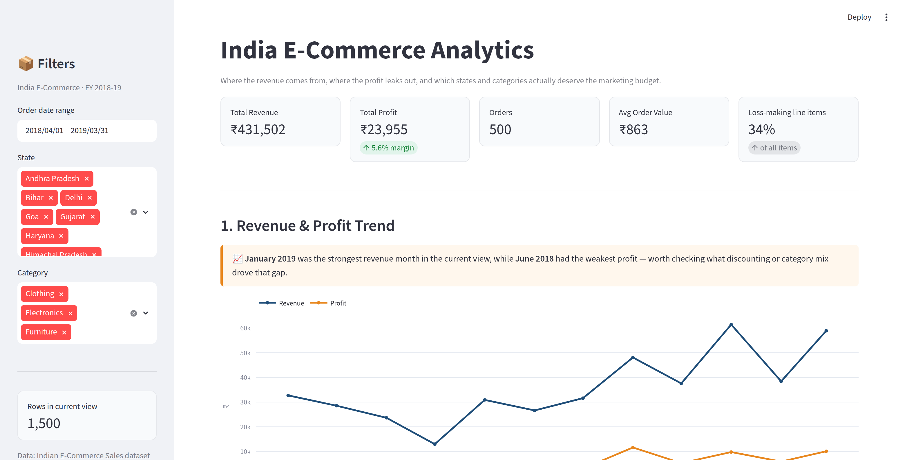
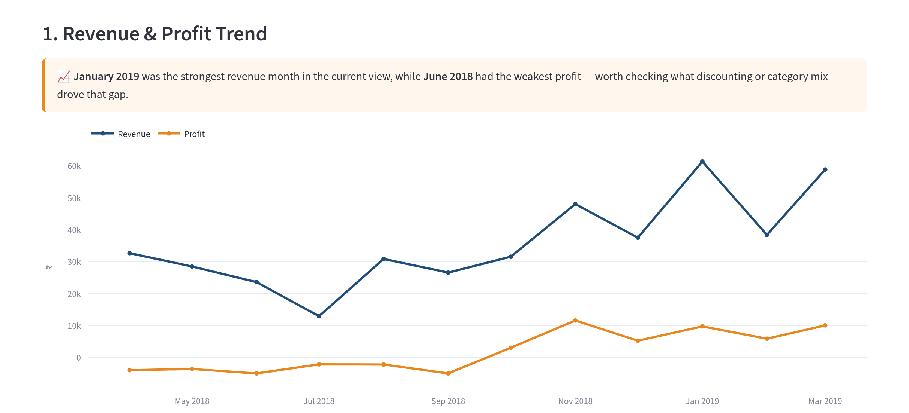
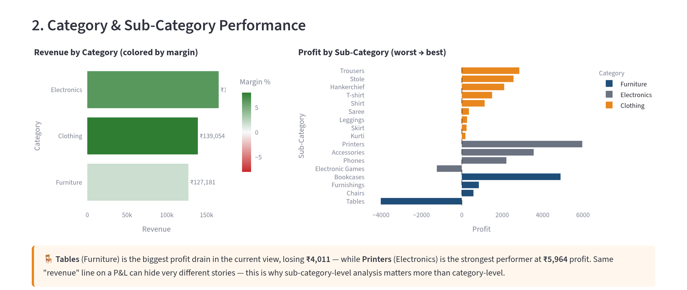
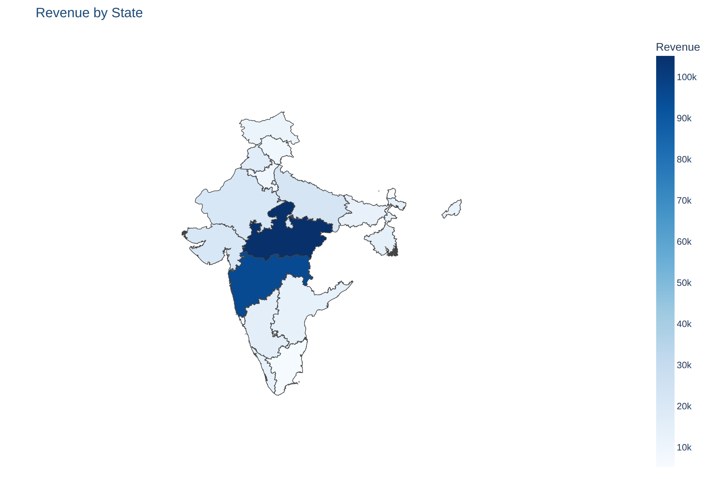
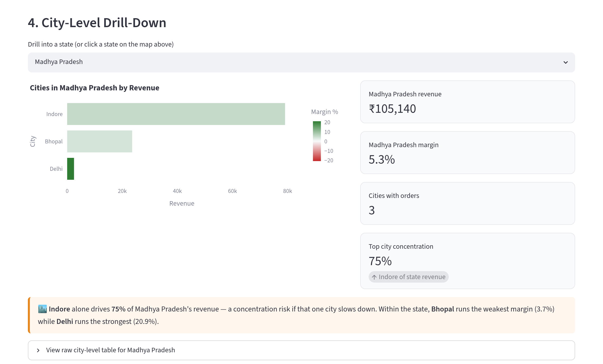
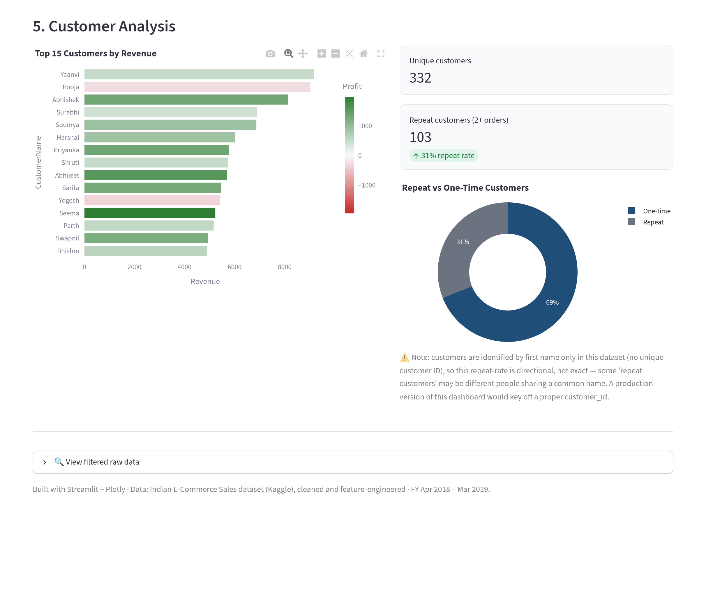

# 🇮🇳 India E-Commerce Analytics Dashboard

> An interactive, **story-driven** analytics dashboard built with **Streamlit + Plotly**
> on *real* Indian e-commerce order data — where the revenue comes from, where the
> profit quietly leaks out, and which states and categories actually deserve the
> next rupee of marketing budget.

<p align="center">
  
</p>

Most portfolio dashboards stop at *"here are six charts."* This one leads every
section with a plain-English insight **computed live from the filtered data** —
because that's the difference between an analyst's dashboard and a BI-tool default
export.

```bash
pip install -r requirements.txt
streamlit run app.py          # opens at http://localhost:8501
```

---

## The 30-second story

Behind ₹431K of revenue sits a business that is **thinner than it looks**:

| Metric | Value | Why it matters |
|---|---:|---|
| **Total revenue** | ₹431,502 | 500 orders · 1,500 line items · FY 2018–19 |
| **Total profit** | ₹23,955 | Just a **5.6% net margin** — little room for error |
| **Loss-making line items** | **33.5%** | One in three items sold *below cost* |
| **Avg order value** | ₹863 | Low-ticket, high-volume retail |
| **Geographic reach** | 19 states · 24 cities | But revenue is heavily concentrated |

Three findings drive the whole narrative:

1. **Revenue and profit don't move together.** A third of all line items lose
   money, so the categories that *look* biggest on a revenue chart aren't
   necessarily the ones paying the bills.
2. **High revenue ≠ a healthy state.** The top revenue state can sit on a
   *negative* margin built from deep discounting — worse for the business than a
   smaller, well-priced one.
3. **Sub-category granularity changes the decision.** "Furniture" looks fine as a
   category; drill in and **Tables** are actively bleeding money while **Printers**
   quietly carry the P&L.

---

## Walkthrough

### 1 · Revenue & profit trend



A dual line of **monthly revenue (blue)** and **monthly profit (amber)**. The gap
between the two lines *is* the story: revenue climbs steadily into the festive/
year-end months and peaks in **January 2019**, but profit stays razor-thin and even
dips below zero in the early months — **June 2018** is the weakest. The amber
callout box above the chart is generated live, so it always names the real
best/worst months for whatever filters are active.

### 2 · Category & sub-category performance



Two views of the same catalogue, side by side:

- **Left — Revenue by Category**, colored by margin (red → white → green). Bar
  *length* shows scale; bar *color* shows health. Electronics and Clothing lead on
  revenue, but the color tells you whether that revenue is actually profitable.
- **Right — Profit by Sub-Category**, sorted worst → best with a zero line. This is
  where the nuance lives: **Tables (Furniture)** is the single biggest profit
  drain (**−₹4,011**), while **Printers (Electronics)** is the strongest performer
  (**+₹5,964**). Same "revenue" line on a P&L can hide completely opposite stories.

### 3 · State-wise performance (interactive choropleth)



An interactive **choropleth map of India**, shaded by the metric you choose —
**Revenue / Profit / Margin % / Orders**. **Madhya Pradesh** leads on revenue
(₹105,140, the darkest state), but toggle the map to *Margin %* and the picture
flips: **Tamil Nadu** posts the weakest margin in the view at **−36.4%** — high
revenue built on discounting. Grey states simply have no orders in the current
filter (the dataset covers 19 of India's states/UTs). **Click any state on the map
to drill straight into its cities below.** A bar-chart tab offers the same data
ranked, for readers who prefer exact values.

> ℹ️ The map loads its base tiles from Plotly's CDN in the browser; the screenshot
> above is the exact figure the app renders.

### 4 · City-level drill-down



Pick a state (or click it on the map) and the dashboard breaks it down to the
**city** level, then surfaces a **concentration-risk** read. In Madhya Pradesh,
**Indore alone drives 75% of the state's revenue** — great today, fragile if that
one city slows. The side metrics and the live callout also flag the weakest- and
strongest-margin cities within the state, so a single "strong state" number never
hides an unbalanced reality underneath.

### 5 · Customer analysis



The **top 15 customers by revenue** (bars colored by profit) alongside a
**repeat-vs-one-time** split: **332 customers, ~31% of them repeat**. Crucially,
the dashboard is *honest about its own limits* — customers are keyed on **first
name only** (there's no unique ID in the source), so the repeat rate is
**directional, not exact**, and the UI says so out loud rather than overstating
precision. That note is a deliberate signal of data judgement, not an oversight.

*(A sixth section — a filtered raw-data explorer with CSV export — sits at the
bottom of the app for anyone who wants the underlying rows.)*

---

## Data

**Source:** Indian E-Commerce Sales dataset (Kaggle), originally three raw files
(`List of Orders.csv`, `Order Details.csv`, `Sales target.csv`) merged and cleaned
into a single order-line-item table.

**Cleaning & feature engineering applied:**
- Trimmed whitespace in `State` / `City` / `CustomerName` (e.g. `"Kerala "` →
  `"Kerala"` — a genuine data-quality bug that would otherwise split a state's
  aggregates in two).
- Parsed `Order Date` into a proper datetime and derived calendar fields
  (year, month, quarter, weekday).
- Added a per-line-item `Profit Margin %`.

**Known limitation (stated up front, not hidden):** customers are identified by
first name only — there is no unique customer ID. The "repeat customer" metric is
therefore directional. A production version would resolve identity with a real
`customer_id` join key.

**Geographic data:** `india_states.geojson` comes from
[geohacker/india](https://github.com/geohacker/india) (state boundaries),
simplified with Shapely (Douglas–Peucker, tolerance 0.01°) to shrink it from
~23 MB to ~0.77 MB — small enough to commit and fast to load, with no visible
degradation at this zoom. All 19 state names in the order data match the geojson's
`State` property exactly, so there's no silent name mismatch (a classic India-map
bug, e.g. "Orissa" vs "Odisha").

---

## Under the hood

- **Live everything.** The date-range, state, and category filters recompute every
  chart *and every insight sentence* — nothing is hardcoded from a one-off
  analysis.
- **Color carries meaning.** Bar and map color scales are margin-driven
  (red → white → green), so profitability reads at a glance without decoding an
  axis.
- **Fast by default.** `@st.cache_data` memoizes the data and geojson loads, so
  re-filtering stays snappy.
- **Click-to-drill interactivity.** Selecting a state on the Plotly choropleth
  updates the city-level section via Streamlit session state.

**Tech stack:** Python · [Streamlit](https://streamlit.io) · [Plotly](https://plotly.com/python/) · pandas

---

## Tests

```bash
pip install pytest
pytest -q
```

The smoke tests in [`tests/test_data.py`](tests/test_data.py) assert that the data
files load from `data/`, expose the columns `app.py` depends on, that the KPI math
is computable, and that **every state in the order data resolves against the
choropleth geojson** — so a broken path or a renamed column fails fast in CI
instead of only at runtime.

---

## Project structure

```
india-e-commerce-analytics-dashboard/
├── app.py                          # Streamlit dashboard (single-file app)
├── data/
│   ├── india_ecommerce_orders.csv  # cleaned, feature-engineered dataset
│   └── india_states.geojson        # simplified India state boundaries
├── assets/screenshots/             # dashboard screenshots used in this README
├── tests/
│   └── test_data.py                # data smoke tests (run with `pytest`)
├── .github/workflows/ci.yml        # lint + test on every push / PR
├── requirements.txt
├── LICENSE
└── README.md
```

---

## Possible extensions

- Swap the CSV for a Postgres connection with a scheduled refresh.
- Add a real `customer_id` and rebuild the repeat-customer metric on true identity
  resolution.
- Join a discount/promotion table (if available) to explain *why* certain
  sub-categories run at a loss — the data currently shows the leak but not the
  driver.

---

## License

Released under the [MIT License](LICENSE).

<sub>Built with Streamlit + Plotly · Data: Indian E-Commerce Sales dataset (Kaggle),
cleaned and feature-engineered · FY Apr 2018 – Mar 2019.</sub>
